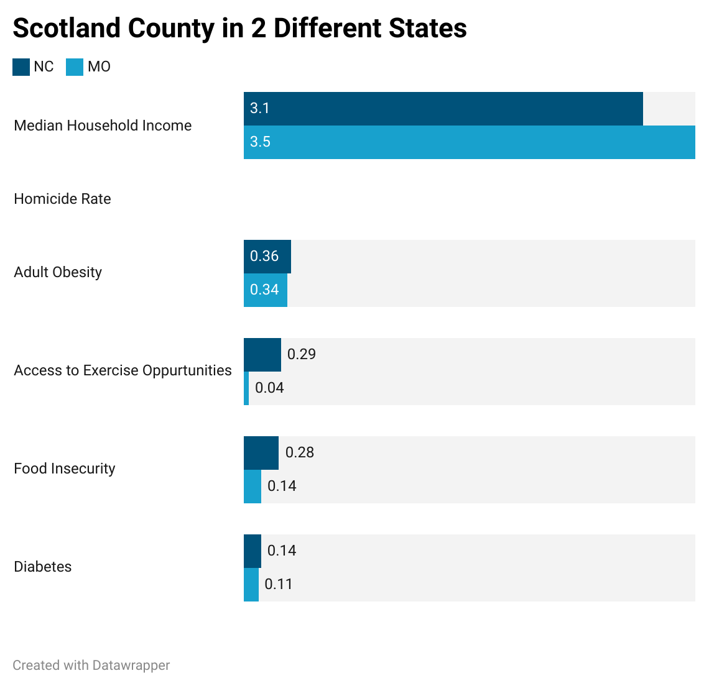

# ENGL-105-Unit-3
## Comparing Scotland County in 2 Different States

The repository contains: 
- A sample data set containing County Health Data
- A Jupiyter Lab notebook containg instructions with the manipulated data
- A seperate CSV file with the manipulated data
- And  a grouped bar chart image that visualizes the manipulated data

I chose the specific data I did because I wanted to learn about my own county. The CountyHealthData.csv contains every county from every state in the United States and it is very interesting to compare the different types of data.

This data is mostly for people who are new to Python and Pandas as it is a good way to get an introduction to using the software. With the simple datatset that can be interesting to anyone this repository is simply meant to show off the basic functions that can be used in Python and Pandas.

The purpose of the specific data I chose and data visualization I made is to hopefully put into perspective the differences in places in the United States in how even if the place has the same name it is so much different in so many different ways. This is present among all counties in the data set but it is good to look at a place that is familiar to me as I can relate and undertsand the data better. (P.S. for Median Household Income 3.1 and 3.5 are in thousands so for NC it is $31,000 and for MO it is $35,000 and the Homicide Rate is excluded because there is no data available for MO) 

People can use this repository in order to learn more about Python and Pandas, and hopefully use this as a springboard into their future endeavors using these softwares.
